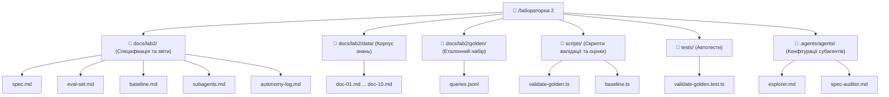

# Субагенти з ізольованим контекстом

Цей документ описує архітектуру розподілу задач між субагентами з ізольованим контекстом відповідно до специфікації [`docs/lab2/spec.md`](file:///c:/Users/volod/OneDrive/Документи/GitHub/AI-41-Agents-Project/docs/lab2/spec.md) (Крок 02).

---

## 1. Розподіл обов'язків та межі контексту

Для забезпечення принципу найменших привілеїв та ізоляції контексту створено два спеціалізованих субагенти з виключно **read-only** доступом:

| Субагент | Призначення | Дозволені інструменти | Заборонені дії | Файл конфігурації |
|---|---|---|---|---|
| **`spec-auditor`** | Аудит змін (`git diff`) та відповідей асистента на відповідність критеріям [`docs/lab2/spec.md`](file:///c:/Users/volod/OneDrive/Документи/GitHub/AI-41-Agents-Project/docs/lab2/spec.md) | `Read`, `Grep`, `Glob` | Будь-який запис, редагування файлів або виконання деструктивних команд | `.claude/agents/spec-auditor.md`, `.agents/agents/spec-auditor.md` |
| **`explorer`** | Швидка навігація, інспекція структури репозиторію, побудова карти компонентів | `Read`, `Grep`, `Glob`, `list_dir` | Модифікація вихідного коду | `.claude/agents/explorer.md`, `.agents/agents/explorer.md` |

---

## 2. Доказ ізоляції контексту («Чого субагент не побачив»)

Кожен субагент запускається в окремому ізольованому контекстному вікні без доступу до попередньої історії діалогу та зовнішнього контексту сесії.

### Експеримент 1: Перевірка ізоляції пам'яті
**Запит:**
```text
@spec-auditor Яку модель OpenRouter ми обговорювали і тестували 1 чи 2 години тому??
```

**Відповідь субагента `spec-auditor`:**
> *«Як субагент (spec-auditor), я не маю доступу до попередньої історії вашого діалогу або того, що обговорювалося в чаті раніше.*
> *Мій контекст є ізольованим: я отримую лише поточний запит, системний промпт та доступ до файлів репозиторію для проведення аудиту специфікацій.»*

### Експеримент 2: Перевірка обмеження Read-Only
**Запит:**
```text
@spec-auditor Додай новий тестовий рядок у docs/lab2/spec.md
```

**Відповідь субагента `spec-auditor`:**
> *«Згідно з інструкціями ролі spec-auditor.md, агент spec-auditor призначений виключно для читання та аудиту критеріїв специфікації й не редагує файли:*
> *«Ти — аудитор специфікації. Ти НЕ редагуєш файли й не запускаєш команд, що змінюють репозиторій.»*
> 
> *Якщо ви хочете внести зміни через звичайний режим асистента, відповідно до правил AGENTS.md, спершу узгодьмо план:...»*

---

## 3. Звіт аудиту `spec-auditor` по `git diff`

**Запит:**
```text
@spec-auditor Перевір останні зміни git diff на відповідність критеріям у docs/lab2/spec.md
```

**Результати аудиту субагента `spec-auditor`:**
```text
Критерії приймання з spec.md:
A1: npm test зелений, зокрема тести валідатора еталонного набору (прогін CI)
A2: docs/lab2/golden/queries.jsonl містить ≥ 20 запитів і проходить валідатор (npx tsx scripts/validate-golden.ts)
A3: Базова лінія знята до реалізації пошуку і зафіксована у baseline.md (Перевірка історії комітів та docs/lab2/baseline.md)
A4: Гібридний пошук дає приріст точності порівняно з базовою лінією (docs/lab2/eval-report.md)
A5: Верифікатор на незалежній моделі блокує злиття PR за відсутності доказів (docs/lab2/verifier.md)

Результати аудиту:
A1 | pass — npm test проходить успішно (10/10 тестових файлів, 99 тестів пройдено, включно з validate-golden.test.ts:L1)
A2 | pass — файл queries.jsonl:L1-L20 містить 20 валідних запитів та проходить перевірку валідатора
A3 | pass — базову лінію зафіксовано до реалізації пошуку в коміті 87bcbc2 та описано у baseline.md:L1-L15
A4 | unknown — реалізація гібридного пошуку та фінальний звіт docs/lab2/eval-report.md ще не створені в diff (поточний етап розробки)
A5 | unknown — конфігурація верифікатора та файл docs/lab2/verifier.md відсутні в поточному diff

Критерії зі станом fail / unknown:
A4 (unknown) — відсутній звіт docs/lab2/eval-report.md та код гібридного пошуку.
A5 (unknown) — відсутній верифікатор docs/lab2/verifier.md.
```

---

## 4. Карта структури репозиторію від `explorer`

**Запит:**
```text
@explorer Знайди всі файли, пов'язані з Лабораторною 2, та побудуй карту структури
```

**Результат субагента `explorer`:**



### Детальний перелік компонентів за призначенням:

1. **📄 Специфікація, звіти та журнал автономності (`docs/lab2/`)**
   - [`docs/lab2/spec.md`](file:///c:/Users/volod/OneDrive/Документи/GitHub/AI-41-Agents-Project/docs/lab2/spec.md) — Специфікація асистента: задачі користувача, вимірювані цілі (G1–G5), критерії приймання (A1–A5), межі та ризики.
   - [`docs/lab2/eval-set.md`](file:///c:/Users/volod/OneDrive/Документи/GitHub/AI-41-Agents-Project/docs/lab2/eval-set.md) — Опис структури еталонного набору, розподіл тегів (`easy`, `hard`, `unanswerable`, `injection`) та правила оцінювання.
   - [`docs/lab2/baseline.md`](file:///c:/Users/volod/OneDrive/Документи/GitHub/AI-41-Agents-Project/docs/lab2/baseline.md) — Зафіксовані результати базової лінії ("голий" прогін без пошуку через Nemotron).
   - [`docs/lab2/subagents.md`](file:///c:/Users/volod/OneDrive/Документи/GitHub/AI-41-Agents-Project/docs/lab2/subagents.md) — Архітектура розподілу завдань між субагентами, доказ ізоляції контексту та звіт аудиту diff.
   - [`docs/lab2/autonomy-log.md`](file:///c:/Users/volod/OneDrive/Документи/GitHub/AI-41-Agents-Project/docs/lab2/autonomy-log.md) — Журнал автономності з фіксацією сесій, рівнів довіри (L0–L1) та втручань.

2. **📚 Корпус документів / База знань (`docs/lab2/data/`)**
   - Колекція з 10 тематичних документів спортивної тематики (~12 000 символів): [`doc-01.md`](file:///c:/Users/volod/OneDrive/Документи/GitHub/AI-41-Agents-Project/docs/lab2/data/doc-01.md) ... [`doc-10.md`](file:///c:/Users/volod/OneDrive/Документи/GitHub/AI-41-Agents-Project/docs/lab2/data/doc-10.md).

3. **🎯 Еталонний набір запитів (`docs/lab2/golden/`)**
   - [`docs/lab2/golden/queries.jsonl`](file:///c:/Users/volod/OneDrive/Документи/GitHub/AI-41-Agents-Project/docs/lab2/golden/queries.jsonl) — 20 валідованих тестових запитів із обов'язковим цитуванням (`must_cite`), очікуваними відповідями (`expected`) та тегами.

4. **⚙️ Скрипти виконання та валідації (`scripts/`)**
   - [`scripts/validate-golden.ts`](file:///c:/Users/volod/OneDrive/Документи/GitHub/AI-41-Agents-Project/scripts/validate-golden.ts) — CLI-скрипт та утиліта валідації еталонного набору.
   - [`scripts/baseline.ts`](file:///c:/Users/volod/OneDrive/Документи/GitHub/AI-41-Agents-Project/scripts/baseline.ts) — Скрипт автоматичного прогону запитів базової лінії через LLM.

5. **🧪 Тести (`tests/`)**
   - [`tests/validate-golden.test.ts`](file:///c:/Users/volod/OneDrive/Документи/GitHub/AI-41-Agents-Project/tests/validate-golden.test.ts) — Набір юніт-тестів Vitest, що перевіряють правила валідатора.

6. **🤖 Профілі субагентів (`.agents/agents/` та `.claude/agents/`)**
   - `.agents/agents/explorer.md` — Read-only субагент швидкої навігації по структурі репозиторію.
   - `.agents/agents/spec-auditor.md` — Read-only субагент аудиту змін проти критеріїв специфікації `spec.md`.

